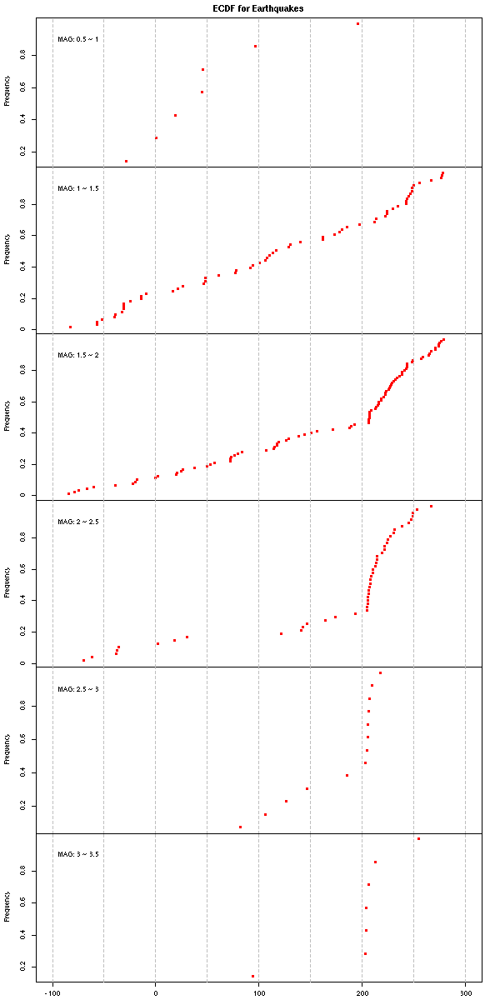

This is the code to plot the ECDF (Empirical Cumulative Density Function) for earthquakes of different MAG using 250.csv  
Remember that this is based on a test data set, not our full one. 

If you want to run the code, please enter the directory where you save the files in `setwd()` in .R file.  

 
