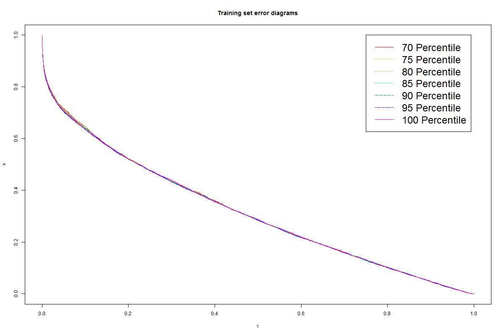

We want to try this really simple model: pick a cutoff time for the successors that we want to cover by our alarm. We pick the cutoff time by looking at event times of the successors of earthquakes within a range as the data and find a specific percentile of the data. The percentiles will be our lengths of alarm window for earthquakes with magnitudes in that range.  

Updated:
----------  
Using our own algorithm of producing tao and v, we examined the models again:  

With our algorithm, Luen's MDA model returns:  
  

Then similar tuning processes are done, and it is showen that considering 5 successors to the earthquakes and seting 95 percentile will return the least area under the error curve:  
  
Detail results to each parameter can be found in [result.csv](result.csv)  

As Prof. Stark suggested, we might want to hold alarm longer for bigger earthquakes to cover more successors. We then thought of setting lower percentiles covering fewer successors for small earthquakes and higher percentiles covering more successors for bigger earthquakes. So we tuned over the number of successors with a list increasing percentiles (70-100) corresponding to each magnitude range.  
Results to the parameters can be found in [result1.csv](result1.csv)  
Number of successor = 1 gives the smallest area:  
  

Though the this increasing-percentile approach does a little bit better, neither the flat-percentile approach nor the increasing-percentile approach outperforms Luen's MDA model.  

------------
Previous Findings:
-----------

For example, we found the 90-percentiles of the successor-times of earthquakes with magnitude from 3 to 7.5 with bin size 0.1:   
  

Then, with such formulation, we plot the error diagram:  
  

-----
What percentile will be the best to set as cutoff?  
How many successors to consider will make the model perform better?  
Let's play with these parameters!!  

First we set number of successors = 1, and try 70, 75, 80, 85, 90, 95, 100 percentiles.  
Error diagram:  
  

It's hard to compare, let's calculate the area under the curve:  
  

Seems like 0.95 has the smallest value. To be more accurate, we look closer into each one of the percentiles from 90 to 100.  
Comparison of the integrations:  
  

----
Follow the similar steps, we found every optimal percentile for different number of successors to consider.  

[Quakers-QuantileMethod.R](Quakers-QuantileMethod.R) is the corresponding R code file, including the summary of the results to each of the parameters.
