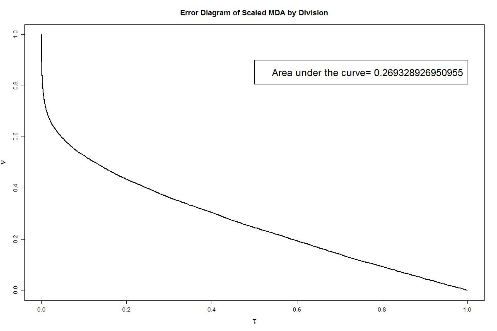
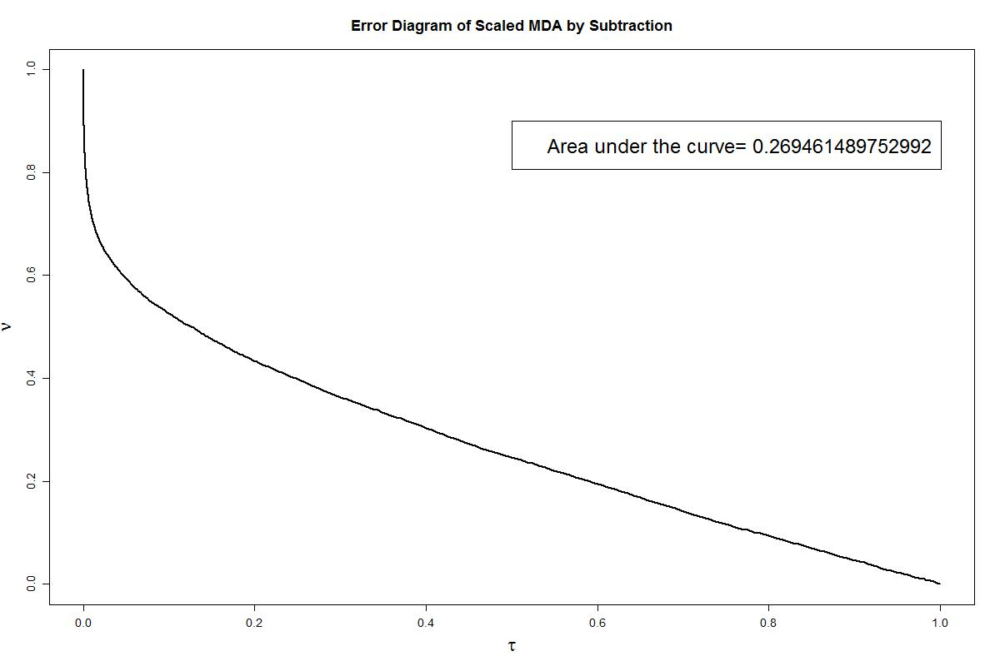

gThis folder contains the final results of the scaled MDA models and their error diagrams correspondingly: 

MDA Div Model `W(M) = k * (mu ^M / M)`  
  

MDA Sub Model `W(M) = k * (mu ^M - tM)`  
  

Codes: [ScaledMDA-Presentation.R](ScaledMDA-Presentation.R)  
