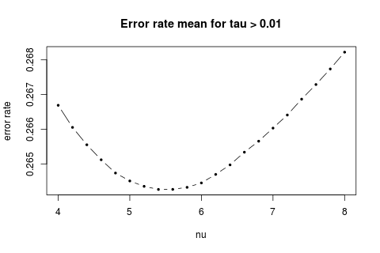
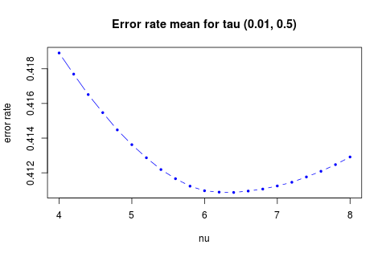

Results for MDA Model (W(M) = k * nu ^M)
--------------------
 
 
 
 
 
 

* The best nu depends on the range of tau we look at.  
The best nu is 5.4, 5.8, 6.4, 6.8, 7, 7.8 for tau in range (0.01, 1), (0.01, 0.75), (0.01, 0.5), (0.01, 0.375), (0.01, 0.25), (0.01, 0.125) accordingly.
* The models don't actually different that much from each other. The range of error rate is less than 1%.

 

  
The reason I don't draw them together is that they are so similiar that we can only see one line if put them all together.
