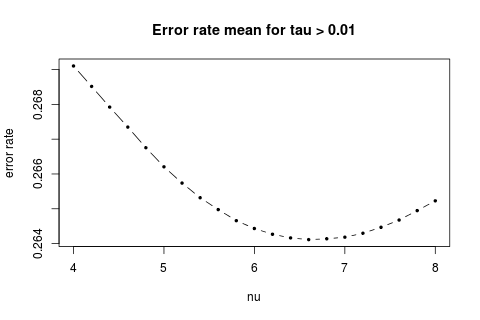

Results for MDA Div Model (W(M) = k * (nu ^M / M))
--------------------
 
 
 
 
 
* The best nu depends on the range of tau we look at.  
The best nu is 6.6, 7, 7.2, 8 for tau in range (0.01, 1), (0.01, 0.75), (0.01, 0.5), (0.01, <= 0.375) accordingly.
* The models don't actually different that much from each other. The range of error rate is less than 1%.

 

  
The reason I don't draw them together is that they are so similiar that we can only see one line if put them all together.
