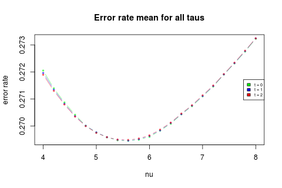
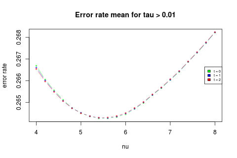
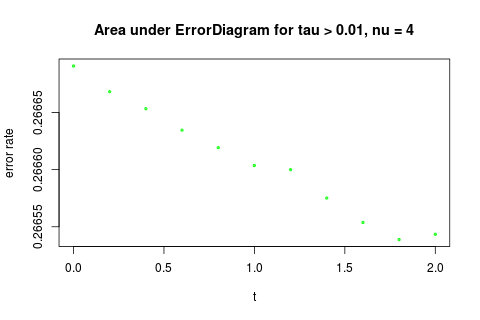
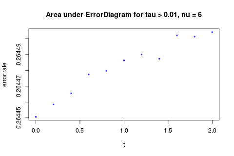

Results for MDA Div Model W(M) = k * (nu ^M - tM)
-------------------------------------------------
 
 
 
 
 
 
 
 

* The best nu depends on the range of tau we look at.  
* For small nu, having a t is better.
* The models don't actually different that much from each other. The range of error rate is less than 1%.

 
 
 
 
 
